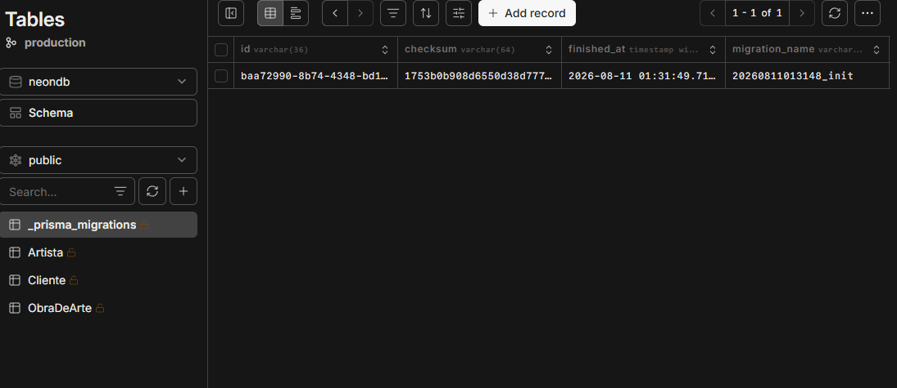
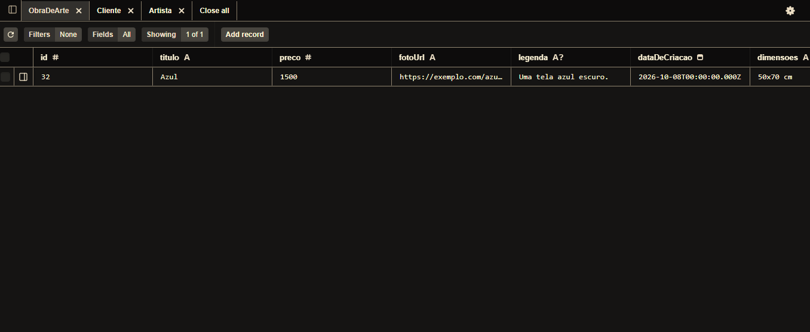
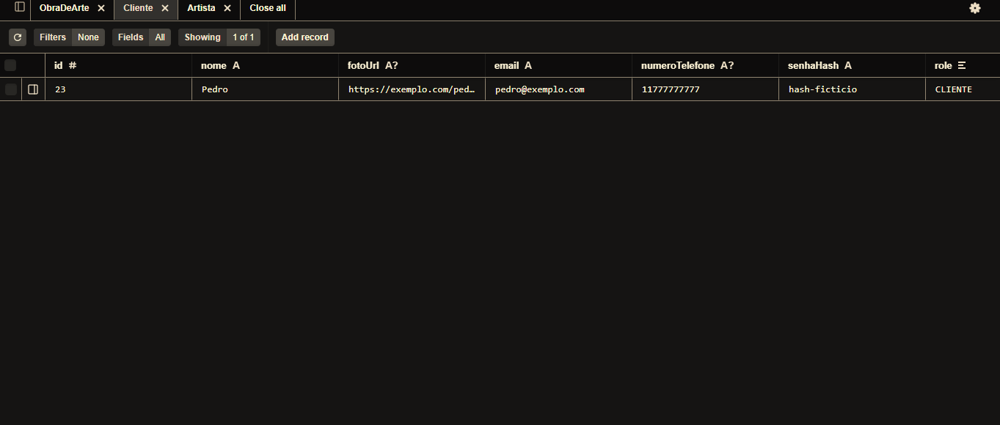
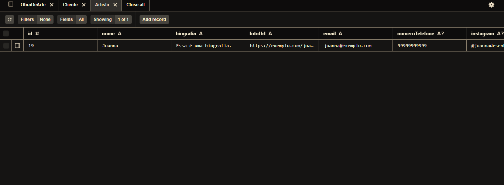

# tf-web-tema
## Exposição e venda das obras de arte de Joanna
### Integrantes (Gatas_Web)
- Alana Júlia Rodrigues de Oliveira:https://share.google/oCZBHnsX2MnXqP6u6
- Debora Tais Alves Rodrigues:https://github.com/Debora-Alves-Rodrigues
- Gabriela Mendes Sousa:https://github.com/gms27?tab=repositories
- Isabelle Cardoso Oliveira:https://github.com/ico4-del
- Joanna de Ângelis Nogueira Costa:https://github.com/Joanna-ornitorrinco
- Maria Tereza Verisssimo de Oliveira e Medeiros:https://github.com/mtvom

### Descrição: 
    A temática do sistema consiste em viabilizar as obras de arte da artista (Joanna), para que ela possa vender, expor consequentemente aumentar a divulgação do seu trabalho. Fazendo com que suas obras de artes alcancem uma gama maior de pessoas, aumentando as chances de ocorrer um número maior de vendas, divulgação, ou até mesmo possibilitando parcerias.

### Principais funcionalidades: 
    Divulgar as artes, estipular preços, e encaminhar as pessoas interessadas nas artes a comprar/encomendar por meio de outro aplicativo.

### Protótipo no Figma
    https://www.figma.com/site/wOYWruxpqKqaoVsDiGi7WP/Acervo-de-Artes-On-line-da-Joanna?node-id=9-2292&t=pEzmbPabaeqM8gz3-1

### Quem são os usuários (público alvo)

    Os usuários os quais formam o público-alvo do site, são pessoas interessadas em arte, sejam aquelas que buscam inspiração visual até aqueles que buscam obter sua própria obra diretamente com o artista, e de forma remota.

### Qual problema o sistema resolve

    O sistema tem como principal objetivo resolver obstáculos referentes à divulgação dos trabalhos da artista, uma vez que, o site foca em possibilitar a exposição das obras de arte facilitando assim o acesso dos produtos para o público que esteja interessado em se tornar consumidor das obras.

# [Modelo Lógico](./prisma/schema.prisma)

# [Atralho para Seed - Modelo Físico](./prisma/seed.js)
# [Atralho para Migrations - Modelo Físico](./prisma/migrations)

### Tabela criada - Neon

--- 

### Tabelas preenchidas - Prisma

---

# Explicando Relacionamentos, Entidades e outras funções no arquivo do [Modelo Conceitual](./db/conceitual.png)

## Entidades

### Artista
    A entidade ‘Artista’ tem como função guardar informações sobre a Dona do site: Joanna. Ela é terá uma versão da página do site para ela fazer o controle das Obras de Arte.

#### Relacionamentos
    Possui relacionamento direto com a entidade “obra de arte” através da ação “Vende”.

#### Atributos
    Conta com os atributos identificadores como: id(identidade), nome, biografia e foto url. E atributos de contato, como email, telefone e Instagram.

#### Cardinalidade
    Em relação a sua cardinalidade, a entidade ‘Artista’ pode vender no mínimo uma e no máximo N obras de arte.

---

### Cliente
    A entidade ‘Cliente’ tem como função acessar o sistema, fazer login com suas informações e comprar as obras expostas pela entidade ‘Artista’.

#### Relacionamentos
    Se relaciona com a entidade ‘Obra de arte’ através do relacionamento ‘Compra’.

#### Atributos
    Possui atributos identificadores: fotourl, nome, id ( identidade) e endereço (número e rua). E atributos de contato também, como; telefone e email.

#### Cardinalidade
    Sobre sua cardinalidade, a entidade ‘cliente’ pode consumir zero ou N de obras de arte.

---

### Obra de Arte
    A entidade ‘Obra de arte’ tem como função armazenar e expor os designs do site disponíveis para compra produzidos pela entidade ‘Artista’.

#### Relacionamentos
    Possui conexão com a entidade ‘Artista’ através do relacionamento ‘Vende’ e com a entidade ‘Cliente’ através do relacionamento ‘Compra”.
    
#### Atributos
    Conta com os atributos; id(atributo identificador), título, preço, fotourl, legenda, dataDeCriacao, dimensão e idDoComprador.

#### Cardinalidade
    Sobre sua cardinalidade, uma obra de arte pode ser comprada por zero ou N clientes, e vendida por um único artista.

---
